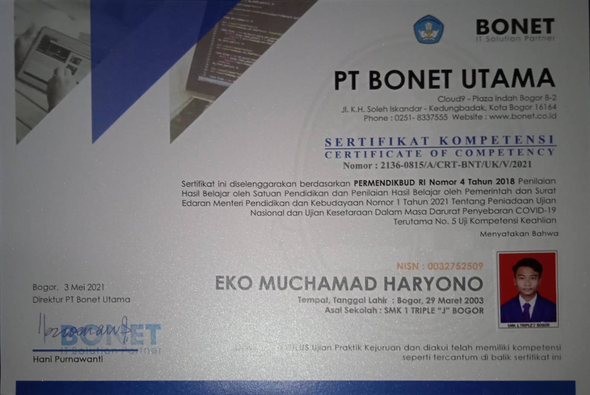
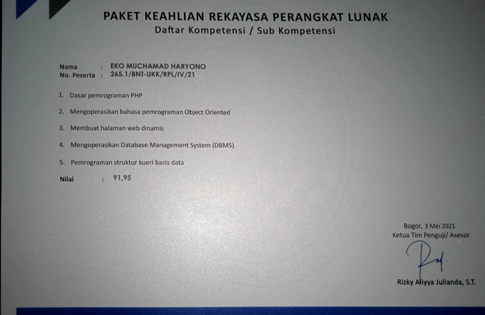

### Hi there, I'm Eko Muchamad Haryono👋

Slogan : "Keep Moving Forward and Keep Developing".

Currently, I am a student at Nurul Fikri Institute of Technology, specializing in Computer Engineering. As a graduate of SMKS 1 TRIPLE J 2020/2021 with a major in Software Engineering, I have a strong background in web development using HTML, CSS, JS, PHP, MySQL, Codeigniter, Laravel, Bootstrap, and collaborative application development using Git, with storage on GitHub and GitLab. Additionally, I have participated in the Jabar Coding Camp (JCC) program, focusing on Laravel - Backend.

In addition to these skills, I have a good understanding of Microsoft Office applications, basics of assembling desktop and laptop computers, as well as installing operating systems and computer applications. I also have experience using Linux operating systems, such as Ubuntu and Manjaro.

<b>Link About Me : </b><a href="https://linktr.ee/ekomh29">https://linktr.ee/ekomh29</a>

   

